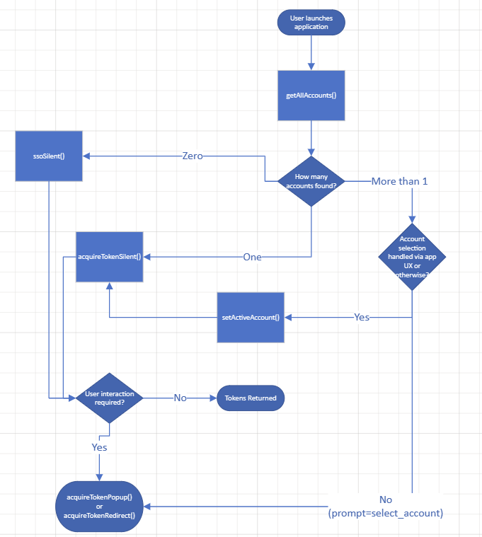

# Initialization of MSAL

Before initializing MSAL Browser, start by [registering your application in the Microsoft Entra admin center](/entra/identity-platform/quickstart-register-app) to obtain obtain the application (client) ID.

## CreatePCA pattern

MSAL.js provides a `CreatePCA` pattern that lets you choose the type of `PublicClientApplication` for your app. Current options include `Standard` and `Nestable` configurations. In the future, more configurations will be introduced.

### Standard Configuration

If you're using MSAL.js in a single-page application, import msal-browser to create an `IPublicClientApplication` instance with `createStandardPublicClientApplication`. This function creates a `PublicClientApplication` instance with the standard configuration.

```javascript
import * as msal from "@azure/msal-browser";

const pca = msal.createStandardPublicClientApplication({
    auth: {
        clientId: "ENTER_CLIENT_ID",
        authority: "https://login.microsoftonline.com/ENTER_TENANT_ID",
    },
});
```

### Nested App Configuration

If your app is an iframed nested app that delegates its authentication to a hub SDK (which is either a SPA or a desktop application running in the MetaOS framework), import msal-browser to create an `IPublicClientApplication` instance with `createNestablePublicClientApplication`. This function creates a `PublicClientApplication` instance with the NAA configuration.

```javascript
import * as msal from "@azure/msal-browser";

const nestablePca = msal.createNestablePublicClientApplication({
    auth: {
        clientId: "ENTER_CLIENT_ID",
        authority: "https://login.microsoftonline.com/ENTER_TENANT_ID",
    },
});
```

> [!IMPORTANT]
> Review the following guidance before opting in for nested app authentication:
>
> - `createNestablePublicClientApplication` falls back to `createStandardPublicClientApplication` if the nested app bridge is unavailable or the hub isn't configured to support nested app authentication.
> - If an application doesn't need to be a nested app, it should use `createStandardPublicClientApplication` instead.
> - Certain account lookup APIs aren't supported in NAA apps. For more information, see [active accounts](./accounts.md#active-account-apis).

## Initializing the PublicClientApplication object

In order to use MSAL.js, you need to instantiate a `PublicClientApplication` object. You must provide the `client id` (`appId`) of your application.

### Option 1

Instantiate a `PublicClientApplication` object and initialize it afterwards. The `initialize` function is asynchronous and must resolve before invoking other MSAL.js APIs.

```javascript
import { PublicClientApplication } from "@azure/msal-browser";

const msalConfig = {
    auth: {
        clientId: 'your_client_id'
    }
};

const msalInstance = new PublicClientApplication(msalConfig);
await msalInstance.initialize();
```

### Option 2

Invoke the `createPublicClientApplication` static method which returns an initialized `PublicClientApplication` object. Note that this function is asynchronous.

```javascript
import { PublicClientApplication } from "@azure/msal-browser";

const msalConfig = {
    auth: {
        clientId: 'your_client_id'
    }
};

const msalInstance = await PublicClientApplication.createPublicClientApplication(msalConfig);
```

## (Optional) Configure Authority

By default, MSAL is configured with the `common` tenant, which is used for multi-tenant applications and applications allowing personal accounts (not B2C).
```javascript
const msalConfig = {
    auth: {
        clientId: 'your_client_id',
        authority: 'https://login.microsoftonline.com/common/'
    }
};
```

If your application audience is a single tenant, you must provide an authority with your tenant id like below:
```javascript
const msalConfig = {
    auth: {
        clientId: 'your_client_id',
        authority: 'https://login.microsoftonline.com/{your_tenant_id}'
    }
};
```

If your application is using a separate OIDC-compliant authority like `"https://login.live.com"` or an IdentityServer, you'll need to provide it in the `knownAuthorities` field and set your `protocolMode` to `"OIDC"`.
```javascript
const msalConfig = {
    auth: {
        clientId: 'your_client_id',
        authority: 'https://login.live.com',
        knownAuthorities: ["login.live.com"],
    },
    system: {
        protocolMode: "OIDC",
    }
};
```

> [!NOTE]
> The `protocolMode` configuration option, which tells MSAL whether to enable Microsoft Entra ID-specific quirks, changes the following behavior:
>
> - Authority metadata (since `v2.4.0`):
>   - When set to `OIDC`, the library doesn't include `/v2.0/` in the authority path when fetching authority metadata.
>   - When set to `AAD` (the default value), the library includes `/v2.0/` in the authority path when fetching authority metadata.

## (Optional) Configure Redirect URI

By default, MSAL is configured to set the redirect URI to the current page that it's running on. If you'd like to receive the authorization code on a different page than the one running MSAL, you can set this in the configuration:
```javascript
const msalConfig = {
    auth: {
        clientId: 'your_client_id',
        authority: 'https://login.microsoftonline.com/{your_tenant_id}',
        redirectUri: 'https://contoso.com'
    }
};
```

Any redirect URI used must be configured in the portal registration. You can also set the redirect URI per request using the [login](./login-user.md) and [request APIs](./acquire-token.md).

## (Optional) Additional Configuration

MSAL has additional configuration options which you can review [here](./configuration.md).

## Handling App Launch with 0 or More Available Accounts

The following flow diagram can help you avoid unnecessary authentication prompts when an account (or multiple accounts) is available for SSO.



## Choosing an Interaction Type

In the browser, there are two ways you can present the login screen to your users from your application:
- [presenting a popup window from the current page](#popup-apis)
- [redirecting the browser window to the login server](#redirect-apis)

### Popup APIs

- `loginPopup`
- `acquireTokenPopup`

The popup APIs use ES6 Promises that resolve when the authentication flow in the popup concludes and returns to the redirect URI specified, or reject if there are issues in the code or the popup is blocked.

#### RedirectUri Considerations

When using popup APIs, the `redirectUri` must point to a dedicated page that implements the MSAL redirect bridge. This page handles the authentication response and communicates it back to the main application.

For detailed guidance on setting up the redirect page, see [RedirectUri considerations](./login-user.md#redirecturi-considerations).

```javascript
msalInstance.loginPopup({
    redirectUri: "http://localhost:3000/redirect",
});
```

### Redirect APIs

- `loginRedirect`
- `acquireTokenRedirect`

Note: If you're using `msal-angular` or `msal-react`, redirects are handled differently, and you should see the [`msal-angular` redirect doc](https://github.com/AzureAD/microsoft-authentication-library-for-js/blob/dev/lib/msal-angular/docs/redirects.md) and [`msal-react` FAQ](https://github.com/AzureAD/microsoft-authentication-library-for-js/blob/dev/lib/msal-react/FAQ.md#how-do-i-handle-the-redirect-flow-in-a-react-app) for more details.

The redirect APIs are asynchronous (i.e. return a promise) `void` functions which redirect the browser window after caching some basic info. If you choose to use the redirect APIs, be aware that **you MUST call `handleRedirectPromise()` to correctly handle the API**. You can use the following function to perform an action when this token exchange is completed:

```javascript
msalInstance.handleRedirectPromise().then((tokenResponse) => {
    // Check if the tokenResponse is null
    // If the tokenResponse !== null, then you are coming back from a successful authentication redirect.
    // If the tokenResponse === null, you are not coming back from an auth redirect.
}).catch((error) => {
    // handle error, either in the library or coming back from the server
});
```

This will also allow you to retrieve tokens on page reload. See the [onPageLoad sample](https://github.com/AzureAD/microsoft-authentication-library-for-js/tree/dev/samples/msal-browser-samples/VanillaJSTestApp2.0/app/onPageLoad/) for more information on usage.

It's not recommended to use both interaction types in a single application.

> [!NOTE]
> `handleRedirectPromise` optionally accepts a hash value to be processed, defaulting to the current value of `window.location.hash`. This parameter only needs to be provided in scenarios where the current value of `window.location.hash` doesn't contain the redirect response that needs to be processed. **For almost all scenarios, applications shouldn't need to provide this parameter explicitly.**

## Next Steps

You are ready to perform a [login](./login-user.md)!
